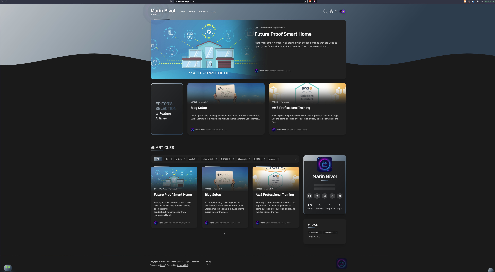

<div align="center">
  <br/>
  <h1> <b>Hacked Aurora Hexo Theme</b></h1>
  <strong>Highly modified, maybe broken</strong>
</div>

<br/>

<p align="center">
  
  
  
  
  
  
  
  
</p>

<div align="center">

**[Preview](https://codeismagic.com)** |
**[Document](https://aurora.tridiamond.tech)**

</div>

Aurora is a next generation theme. It gives you the feel of smooth flow of colours and a futuristic feeling.

---
> Installing:
- Clone this repository into your `themes` folder
- > `cp themes/aurora/_config.yml _config.aurora.yml`
- change your default `theme:` in `_config.yml` to `aurora`.

<br/>




### ⭐️ Features

- Featured section - _Can add a feature meta to any post, those will be pinned into the feature section on the home page._
- Multi-language support - _Can dynamically switch the language of the main texts in the application._
- Statistics - _Statistic of article words, posts, categories and tags counts._
- Article reading time - _Show the estimated reading time of an article._
- Mathjax support - _Support mathjax syntax in markdown files._
- SPA - _No page loading or freezing from page to page._
- Comments plugin - _[Giscus](https://giscus.app/) Github discussions chat system_
- Blog search - _Enable to search all the articles in the blog._
<!-- - Latest comments - _Added a widget showing the latest comments, supported using `Giscus` or `Valine`._ -->

<br><br>

### 🎨 Theme

- Light and dark - _Light and dark theme support._
- Magazine Layout - _Modern magazine grid layout._
- Gradient Colours - _Modern gradient colour styles_.
- Timeline styled archives - _Archived posts into a timeline format_.

<br><br>

### 🛠 Configuration

<!-- - Beian Config - _This feature is especially for China users, for those that need to put Beian info at the footer of the blog._ -->
- Customizable menu - _Can customize your menu with internal links, external links, custom pages._
- Post navigation - _Can navigate to the previous and next article at the end of the article page._
- Custom pages - _Can add any custom pages, need to use the customized menu to display in the menu._
- Page navbar - _Can set up a sidebar on the specific page, act as the sub-menu of the page._

<br><br>

## ⚠️ Fix node errors
This can run with the latest node.js version, with some tolerable warnings and the following:
```bash
rm -rf node_modules yarn.lock
yarn install -std=c++17 --ignore-engines
```

<br><br>

### Update packages
```bash

yarn add axios core-js js-cookie normalize.css nprogress pinia sass truncate-html vue vue-class-component vue-i18n vue-router  vue3-click-away vue3-lazy vue3-scroll-spy giscus -std=c++17 --ignore-engines

yarn add @tailwindcss/postcss7-compat @types/jest @types/js-cookie @types/node @types/nprogress @typescript-eslint/eslint-plugin @typescript-eslint/parser @vue/cli-plugin-babel @vue/cli-plugin-eslint @vue/cli-plugin-router @vue/cli-plugin-typescript @vue/cli-plugin-unit-jest @vue/cli-service @vue/compiler-sfc @vue/eslint-config-prettier @vue/eslint-config-typescript @vue/test-utils autoprefixer eslint eslint-plugin-prettier eslint-plugin-vue hexo-pagination hexo-util js-yaml postcss prettier runjs sass-loader script-ext-html-webpack-plugin svg-sprite-loader svgo tailwindcss typescript vue-jest  -std=c++17 --ignore-engines

```
